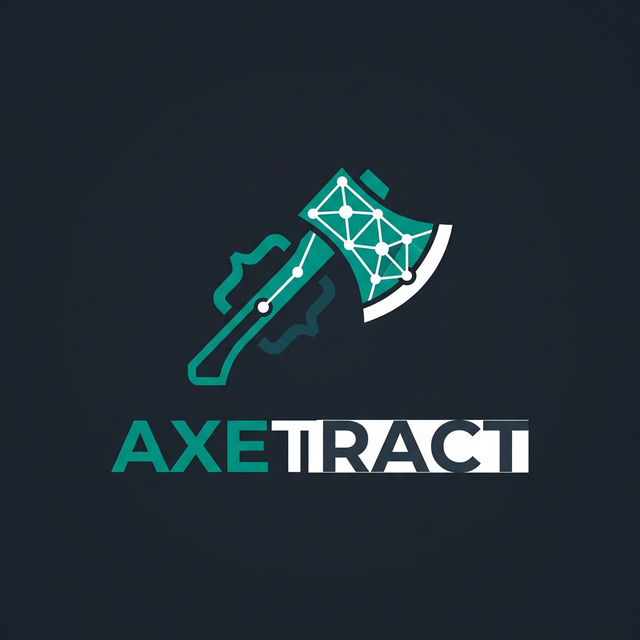

<p align="center">
  
</p>

# Axetract

**High-performance, LoRA-powered web data extraction.**

[Getting Started](getting-started.md){ .md-button .md-button--primary }
[GitHub](https://github.com/abdo-Mansour/axetract){ .md-button }

---

<div class="grid cards" markdown>

-   :material-rocket-launch:{ .lg .middle } **Extreme Efficiency**
    ---
    Achieve state-of-the-art extraction accuracy with 0.6B parameter models.

-   :material-brain:{ .lg .middle } **LoRA Switching**
    ---
    Dynamically switch between pruning and extraction adapters in a single VRAM footprint.

-   :material-target:{ .lg .middle } **Grounded XPath (GXR)**
    ---
    Automatically map extracted data back to the original DOM XPaths.

-   :material-lightning-bolt:{ .lg .middle } **vLLM Support**
    ---
    Built-in support for high-throughput batch processing with vLLM.

</div>

## Why Axetract?

Traditional web extractors are often a trade-off between brittle manual heuristics and the prohibitive cost of Large Language Models. Axetract provides a solution: the intelligence and flexibility of an LLM with the efficiency of a local 0.6B model via intelligent DOM pruning.

| Feature | Axetract (0.6B) |
|---------|-----------------|
| Accuracy (SWDE F1) | **88.1%** |
| Compute Required | **Low (0.6B)** |
| Cost | **Free (Local)** |
| Privacy | **100% On-Prem** |

---

## Quick Start

```python
from axetract import AXEPipeline

# Create a pipeline with default LoRA adapters
pipeline = AXEPipeline.from_config()

# Extract data from a URL
result = pipeline.process(
    input_data="https://example.com/product",
    query="Extract the product name, price, and currency"
)

print(result.prediction)
# Output: {'name': 'Smartphone X', 'price': 999.0, 'currency': 'USD'}
```

## Get Involved

- [GitHub Repository](https://github.com/abdo-Mansour/axetract)
- [Hugging Face Adapters](https://huggingface.co/abdo-Mansour)
- [Issue Tracker](https://github.com/abdo-Mansour/axetract/issues)
