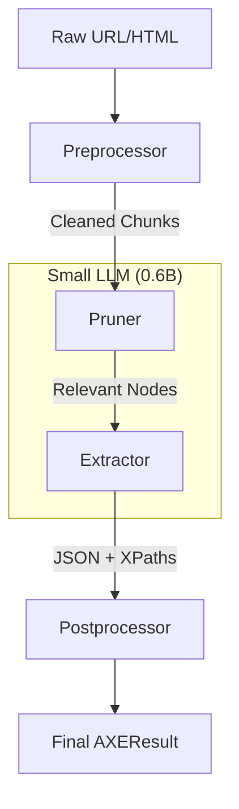

# Architecture

Axetract follows a modular pipeline architecture designed for high-performance extraction.

## The Four Pillars

### 1. Preprocessor
The preprocessor fetches the raw HTML (if a URL is provided) and performs initial cleaning. It uses `html-chunking` to break down the document into manageable pieces while preserving semantic structure.

### 2. Pruner (LoRA Powered)
Most web pages contains 90% boilerplate (headers, footers, ads). The Pruner uses a specific LoRA adapter to identify and keep only the parts of the DOM relevant to the user's query. This drastically reduces the number of tokens passed to the Extractor.

### 3. Extractor (LoRA Powered)
The Extractor is the brain of the pipeline. It takes the pruned HTML and the desired schema/query to produce a structured JSON output. What makes Axetract unique is **Grounded XPath Resolution (GXR)**: the extractor doesn't just return text; it returns the exact XPaths of the elements in the original document.

### 4. Postprocessor
The postprocessor performs final cleanup, schema validation (using `json-repair` if needed), and formatting of the results.

## Multi-LoRA Strategy

Axetract uses a "base model + adapters" strategy. Both the Pruner and Extractor share the same base model (e.g., Qwen3-0.6B). When processing:
1. Load the base model.
2. Load Pruner adapter.
3. Switch to Extractor adapter for final inference.

This allows high intelligence without the VRAM cost of multiple models.
