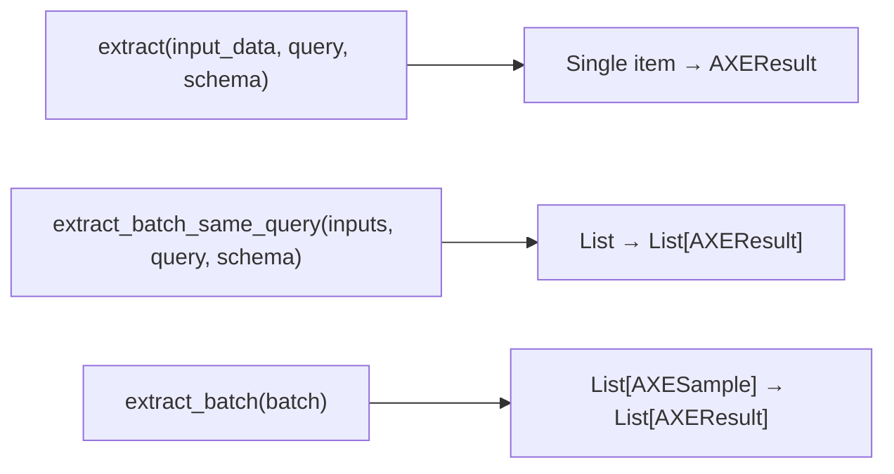
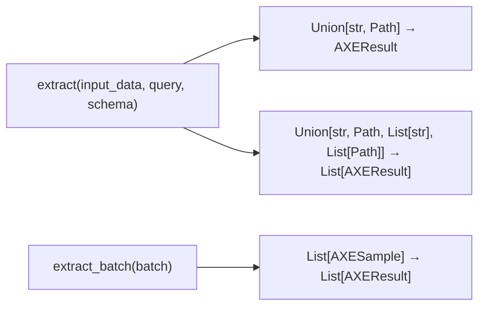

# Plan: Unify extract() API - Issue #9

## Overview

Unify the `extract()` API to accept both single items and lists, removing `extract_batch_same_query()` entirely.

## Issue Summary

**Original Issue**: Unify `extract()` API to accept a list, removing the need for `extract_batch_same_query()`

**User Directive**: Since the package hasn't been published yet, REMOVE (not deprecate) `extract_batch_same_query()` directly.

## Current API vs Proposed API

### Current State



### Proposed State



## Files to Modify

| File | Changes |
|------|---------|
| `src/axetract/pipeline.py` | Modify `extract()` to accept list, remove `extract_batch_same_query()` |
| `tests/test_pipeline.py` | Update tests to use `extract()` with list |
| `tests/e2e/test_e2e.py` | Update tests to use `extract()` with list |
| `examples/basic_usage.py` | Update example to use `extract()` with list |
| `docs/examples/batch.md` | Fix API names (`process_many` → `extract`, `process_batch` → `extract_batch`) |
| `CHANGELOG.md` | Document breaking change |

## Implementation Details

### 1. Modify `extract()` in `pipeline.py`

```python
from typing import overload, Union, List, Optional, Type
from pathlib import Path
from pydantic import BaseModel

@overload
def extract(
    self,
    input_data: Union[str, Path],
    query: Optional[str] = None,
    schema: Optional[Union[Type[BaseModel], str, Dict[str, Any]]] = None,
) -> AXEResult: ...

@overload
def extract(
    self,
    input_data: List[Union[str, Path]],
    query: Optional[str] = None,
    schema: Optional[Union[Type[BaseModel], str, Dict[str, Any]]] = None,
) -> List[AXEResult]: ...

def extract(self, input_data, query=None, schema=None):
    if isinstance(input_data, list):
        # Convert list of inputs to AXESample objects and process
        batch = []
        for data in input_data:
            if isinstance(data, Path):
                content_str = self._read_path_content(data)
                is_url = False
            else:
                content_str = data
                is_url = data.strip().startswith(("http://", "https://"))
            batch.append(AXESample(...))
        return self.extract_batch(batch)
    else:
        # Single item logic (existing)
        ...
```

### 2. Remove `extract_batch_same_query()`

Delete the method entirely since it's being replaced by the unified `extract()`.

### 3. Update Tests

Replace:
```python
pipeline.extract_batch_same_query(["<p>A</p>", "<p>B</p>"], query="shared?")
```

With:
```python
pipeline.extract(["<p>A</p>", "<p>B</p>"], query="shared?")
```

### 4. Update Documentation

Fix `docs/examples/batch.md`:
- `process_many` → `extract` (for same-query extraction)
- `process_batch` → `extract_batch` (for heterogeneous extraction)

## Breaking Changes

- **`extract_batch_same_query()` is removed** - Use `extract(inputs_list, query=...)` instead
- Return type of `extract()` when passed a list is `List[AXEResult]` instead of `AXEResult`

## Verification Checklist

- [ ] `pipeline.extract("https://example.com", query="...")` returns single `AXEResult`
- [ ] `pipeline.extract(["https://a.com", "https://b.com"], query="...")` returns `List[AXEResult]`
- [ ] `pipeline.extract_batch([AXESample(...), AXESample(...)])` still works unchanged
- [ ] All tests pass
- [ ] No references to `extract_batch_same_query` remain
